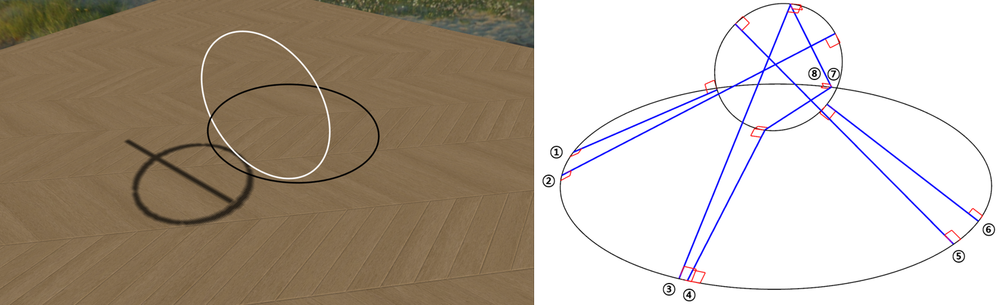
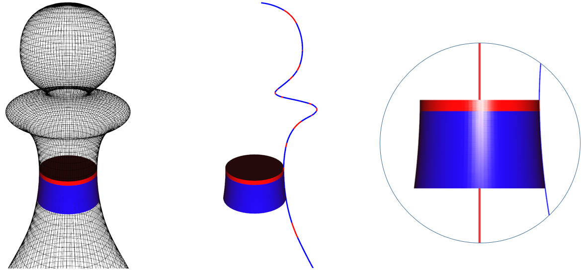
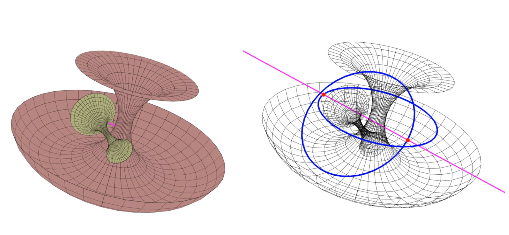

# MinuteTorus

  

**C++ library that supports basic math operations related to torus :  Computing Osculating Toroidal Patch, Computing Binormal Lines between Toroidal Patches, Computing Gaussmaps of Toroidal patches, etc.**

Please refer to following papers to learn about details of this library :

[1] Sang-Hyun Son, Seung-Hyun Yoon, Myung-Soo Kim, Gershon Elber, *Efficient Minimum Distance Computation for Solids of Revolution*, Eurographics & Eurovis (Computer Graphics Forum 2020) ([Youtube](https://www.youtube.com/watch?v=BoRHXYlMLIg&list=LL2Ppr2hf2VJkzTxKmkx-GzA&index=6&t=0s))

# Videos
With this library's functions, we can compute distance between tori and detect their collisions much more efficiently than conventional algorithms. The videos below show some  physical simulation results. Please refer to [this talk](https://www.youtube.com/watch?v=BoRHXYlMLIg&list=LL2Ppr2hf2VJkzTxKmkx-GzA&index=6&t=0s) for more videos.

  
  
  

# Explanation
## Circle
Circles play important roles in geometric computations related to tori : they offer efficient algorithm to find local extremums of distance between different tori. Therefore, this library offers algorithms to find **binormals - line that passes through two geometric entities orthogonally at the same time -** between two circles in 3D space. Also, it offers an algorithm to find **minimum distance** between two circles in 3D space, which is much faster than finding every binormal, as minimum distance is just the shortest binormal.

  

## Torus
Torus can be used to approximate freeform surfaces much precisely than other geometric entities. When it comes to surface or volume of revolution, approximation power of torus is maximized. This library offers algorithm to **approximate freeform surfaces with toroidal patches**. Also, it offers an efficient algorithm to **find binormal lines between those toroidal patches** - this algorithm is built upon the algorithm that finds binormal lines between circles. With this algorithm, we can find minimum distance between toroidal patches very efficiently.

  
  

## Gaussmap
Computing binormals between tori can be accelerated by using their gaussmaps. This library currently offers some limited functions about this gaussmap computation.

