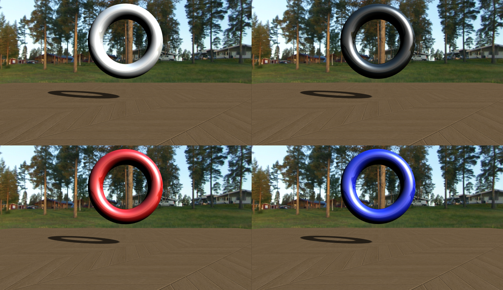

# MinuteTorus

  

**C++ library that supports basic math operations related to torus :  Computing Osculating Toroidal Patch, Computing Binormal Lines between Toroidal Patches, Computing Gaussmaps of Toroidal patches, etc.**
